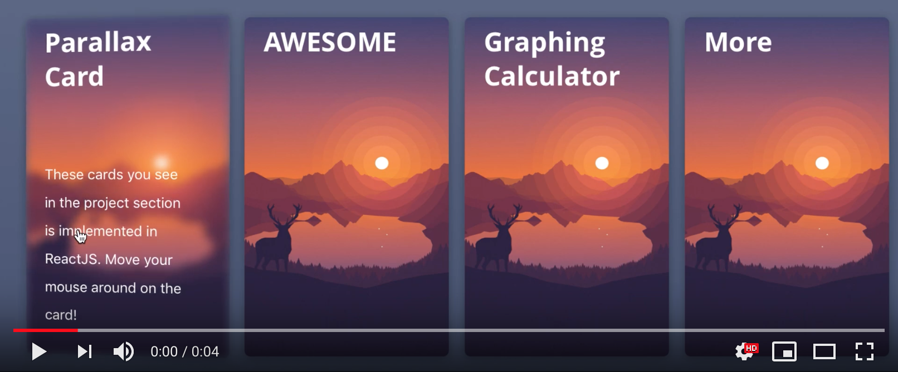

# React-Parallax-Card
A card with parallax effect the the user mouse-over it.
[](https://youtu.be/GqAM1OTnY3Q "Demo")
## How to Intergrate in my project?
Import parallaxCard.js and index.css in your project.

Create a card with:
```
<ParallaxCard title='...' description='...' bgImg={...}/>
```

### Example:
```
<ParallaxCard title='Parallax Card' description='These cards you see in the project section is implemented in ReactJS. Move your mouse around on the card!' bgImg = {require('./bg1.png')}/>
```
